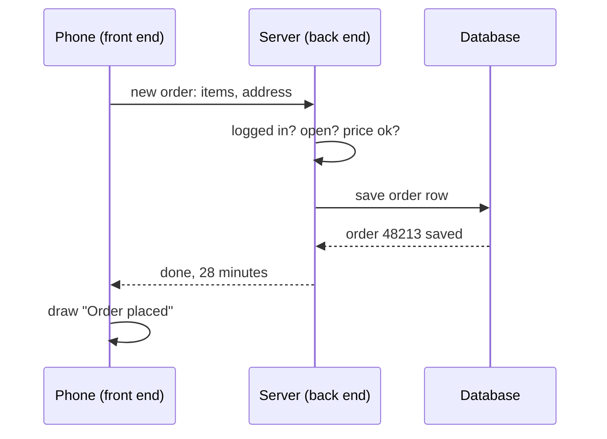
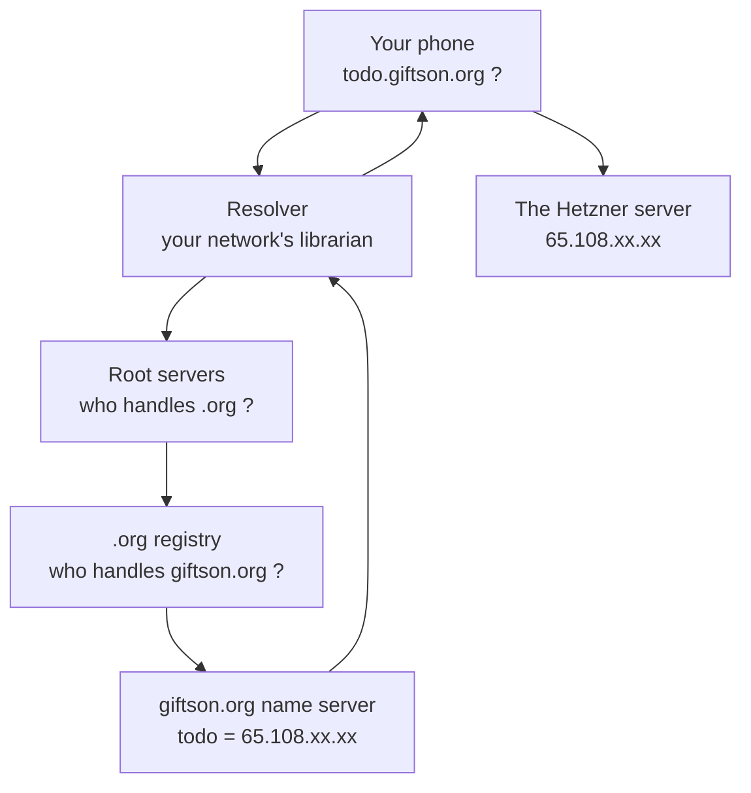
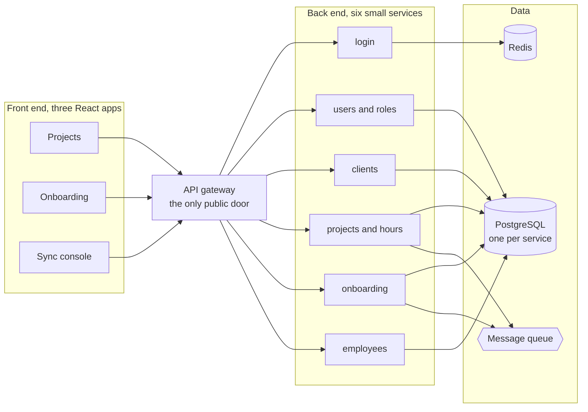

<div class="dim mb-6">Guest lecture &nbsp;|&nbsp; Friday 9 October 2026, 9:30 AM &nbsp;|&nbsp; FX 313</div>

# Modern<br>Full Stack<br>Development

<p class="text-xl" style="max-width: 36rem">
How a tap on your phone becomes a row in a database and comes back as a screen.
We will build one, together, and put it on the internet.
</p>

<div class="mt-10 flex gap-10 items-end">
  <div>
    <div class="text-lg font-bold">K. Gift Brightson</div>
    <div class="dim">Software Engineer, Cyrino India Pvt. Ltd., Chennai</div>
  </div>
  <div class="dim small">
    For II CSE C<br>Coordinator: Mrs. M. Sathya, AP/CSE
  </div>
</div>

<div class="abs-br m-10 dim small text-right">
  Francis Xavier Engineering College<br>Vannarpettai, Tirunelveli
</div>

<!--
Hands up: who has made a web page? Who has written a Java class? Who has used SQL? Keep count. By the end, every hand should go up for all three.
-->

---
layout: two-cols
layoutClass: gap-12
class: compact
---

# Five years of building things people use

<p class="kicker">I sat in a classroom like this one in 2019.</p>

<div class="stack mt-2">
  <div class="layer fe"><span class="name">Front end</span><span class="sub">React, TypeScript, mobile apps. The screens.</span></div>
  <div class="layer be"><span class="name">Back end</span><span class="sub">Java and Spring Boot, Node, Python. The rules and the logic.</span></div>
  <div class="layer db"><span class="name">Database</span><span class="sub">PostgreSQL, SQL Server, MongoDB. The memory that survives.</span></div>
</div>

<div class="mt-5 note small">
  <p>Plus the things around them: Docker, cloud servers on AWS and Azure, automated deployments, and an AI search product built on a vector database.</p>
  <p class="mt-2">Awarded <b>Engineer of the Year, 2024</b> at my previous company.</p>
</div>

::right::

<div class="mt-16">

<div class="hop"><span class="step">'17</span><div><div class="who">B.E. Computer Science, 2017 to 2021</div><div class="say">Same syllabus shape as yours. Same confusion in second year.</div></div></div>
<div class="hop"><span class="step">'21</span><div><div class="who">Full stack developer</div><div class="say">Admin dashboards, a mobile app, video calling built in.</div></div></div>
<div class="hop"><span class="step">'22</span><div><div class="who">Full stack, then back end engineer</div><div class="say">Hospital portals for patients and doctors. A data pipeline on Azure.</div></div></div>
<div class="hop"><span class="step">'24</span><div><div class="who">Senior engineer, technical owner</div><div class="say">Moved 20+ services of a global fitness company to the cloud with zero downtime. Built an AI assistant that answers from company documents.</div></div></div>
<div class="hop"><span class="step" style="background:var(--be)">'25</span><div><div class="who">Software Engineer, Cyrino India, Chennai</div><div class="say">A product-onboarding platform for a retail client abroad, and our own company's delivery platform.</div></div></div>

</div>

<!--
90 seconds. The point is not me. The point is that the path from this room to that job is short and real.
-->

---

# The jobs behind the word "engineer"

<p class="kicker">Same degree. Four very different days. All of them start from today's three layers.</p>

<div class="grid grid-cols-2 gap-4 mt-2">

<div class="band fe">
<h3>Full stack engineer</h3>
<p>Owns one feature from the screen to the table. I built patient, admin and doctor portals this way, sitting next to the designer.</p>
</div>

<div class="band be">
<h3>Back end engineer</h3>
<p>Owns data and rules that many screens share. I built a pipeline that read vendor files every night, cleaned them, and loaded them into a database.</p>
</div>

<div class="band plain">
<h3>Senior engineer, technical owner</h3>
<p>Owns the outcome, not just the code. Moving a payment page and a login service to a new cloud setup with no downtime meant more talking than typing.</p>
</div>

<div class="band plain">
<h3>Platform and AI engineer</h3>
<p>Owns the architecture of something new. A pipeline that reads websites, breaks them into pieces, stores them so a chatbot can find the right piece in milliseconds.</p>
</div>

</div>

<p class="mt-4 dim small">Not on this list: "coder". Nobody is paid to type. People are paid to understand what the typing does.</p>

---

# What I build this year, with the names removed

<div class="grid grid-cols-2 gap-5 mt-2">

<div class="note">
<h3>A retail product-onboarding system</h3>
<p class="dim">A retail chain abroad. Every new product they sell has to be entered, checked, audited and approved before it reaches shelves.</p>
<div class="mt-3 small">
<div><span class="fe font-bold">Front end</span> &nbsp;React, TypeScript, data tables with thousands of rows</div>
<div><span class="be font-bold">Back end</span> &nbsp;Four small Node services: API, audit log, email, scheduler</div>
<div><span class="db font-bold">Database</span> &nbsp;SQL Server, with migration scripts for every change</div>
<div class="dim">Around it: Microsoft login, a message queue, automatic deploys from GitHub</div>
</div>
</div>

<div class="note">
<h3>Our own delivery platform</h3>
<p class="dim">Projects, who works on what, hours, HR onboarding with e-signing, and a portal for candidates.</p>
<div class="mt-3 small">
<div><span class="fe font-bold">Front end</span> &nbsp;Three React apps sharing one design</div>
<div><span class="be font-bold">Back end</span> &nbsp;One gateway and six NestJS services, one per subject</div>
<div><span class="db font-bold">Database</span> &nbsp;One PostgreSQL per service, Redis for speed</div>
<div class="dim">Around it: single sign-on, Docker, Terraform, a message queue</div>
</div>
</div>

</div>

<div v-click class="mt-5 text-center text-lg">
The names change every year. The shape never does:
<span class="fe font-bold">front end</span> → <span class="be font-bold">back end</span> → <span class="db font-bold">database</span>.
</div>

---

# You already have most of the pieces

<p class="kicker">From your Semester III and IV syllabus. I checked.</p>

<div class="grid grid-cols-2 gap-x-10 gap-y-3 mt-3">

<div v-click class="band plain"><b>Object Oriented Programming using Java</b> (24CS3602)<br><span class="small dim">A class with fields is a table with columns. Today we attach a table to a class in one line.</span></div>
<div v-click class="band plain"><b>Data Structures</b> (24CS3601)<br><span class="small dim">JSON, the text that travels between layers, is just a HashMap and an ArrayList written out.</span></div>
<div v-click class="band plain"><b>Computer Organization and Architecture</b><br><span class="small dim">RAM forgets on restart, disk remembers. That is the whole reason a database exists.</span></div>
<div v-click class="band plain"><b>Database and SQL Programming</b> (24CS4601, next semester)<br><span class="small dim">You will see your first real SQL query today, six months early.</span></div>
<div v-click class="band plain"><b>Operating Systems</b> (next semester)<br><span class="small dim">A server is a process listening on a port. Two programs, two ports, same laptop.</span></div>
<div v-click class="band plain"><b>Soft skills</b> (24PT3902)<br><span class="small dim">Half of my week is explaining a bug to someone who is not an engineer. This counts.</span></div>

</div>

<p v-click class="mt-4 text-center">Nothing today is outside your reach. It is your syllabus, connected.</p>

<!--
This slide earns trust. They have been told these subjects are "theory". Show them each one is a load-bearing wall.
-->

---

# Today, in five parts

<div class="grid grid-cols-5 gap-3 mt-4">

<div v-click class="note"><span class="step">1</span><h3 class="mt-2">One tap</h3><p class="dim">What really happens when you order food on your phone.</p></div>
<div v-click class="note"><span class="step">2</span><h3 class="mt-2">Three layers</h3><p class="dim">Each one explained with a little real code.</p></div>
<div v-click class="note"><span class="step">3</span><h3 class="mt-2">Build it</h3><p class="dim">A todo app with sign up, in Java and React, built live in front of you.</p></div>
<div v-click class="note"><span class="step">4</span><h3 class="mt-2">Ship it</h3><p class="dim">Put it on a real server with a real web address. How a name finds a computer.</p></div>
<div v-click class="note"><span class="step">5</span><h3 class="mt-2">Your next 3 years</h3><p class="dim">What to learn when, what interviews test, and questions.</p></div>

</div>

<div v-click class="mt-8 note">
<p><b>One rule for the next hour:</b> when something on screen breaks, we do not hide it. We read the error together. That is the job.</p>
</div>

---
layout: center
class: text-center
---

# What happens when you tap "Place order"?

<p class="dim text-lg mt-2">You have done it a thousand times. Let's slow one second down.</p>

---
layer: all
class: compact
---

# One tap, six hops, about a third of a second

<div class="grid grid-cols-2 gap-8 mt-2">

<div>

<div v-click class="hop"><span class="step" style="background:var(--fe)">1</span><div><div class="who fe">Your phone</div><div class="say">The app collects your cart and sends a message over the internet: "new order, these items, this address".</div></div></div>
<div v-click class="hop"><span class="step" style="background:var(--be)">2</span><div><div class="who be">A computer somewhere</div><div class="say">The back end receives it. Are you logged in? Is the shop open? Is the price what the app claims?</div></div></div>
<div v-click class="hop"><span class="step" style="background:var(--db)">3</span><div><div class="who db">The database</div><div class="say">Saves the order as a row. Reduces stock. This survives even if the power goes.</div></div></div>
<div v-click class="hop"><span class="step" style="background:var(--be)">4</span><div><div class="who be">The back end replies</div><div class="say">"Done. Order 48213. 28 minutes."</div></div></div>
<div v-click class="hop"><span class="step" style="background:var(--fe)">5</span><div><div class="who fe">Your phone</div><div class="say">Reads the reply and draws the "Order placed" screen.</div></div></div>

<p v-click class="small mt-3"><b>Full stack</b> means you can write, fix and explain every one of those hops. Not master all of them on day one. Follow a problem across them.</p>

</div>

<div>



</div>

</div>

---
layer: all
---

# The three layers, as a halwa shop

<p class="kicker">Think of the famous evening shop in Tirunelveli with the long queue.</p>

<div class="grid grid-cols-[1.15fr_1fr] gap-8 items-start">

<div class="stack">
  <div v-click class="layer fe"><span class="name">Front end</span><span>The counter. What the customer sees and touches. Runs on <b>your</b> phone or browser. HTML, CSS, JavaScript, React.</span></div>
  <div v-click class="layer be"><span class="name">Back end</span><span>The kitchen. Takes the slip, applies the rules, makes the thing. Runs on a <b>server</b>. Java and Spring Boot.</span></div>
  <div v-click class="layer db"><span class="name">Database</span><span>The store room. Ghee, sugar, wheat, kept safe and counted. Runs on a disk. PostgreSQL, MySQL, SQL Server.</span></div>
</div>

<div v-click class="note">
<h3>The slip of paper is the API</h3>
<p>The counter never walks into the kitchen. It writes a slip: "half kg halwa, counter 2". The kitchen never argues about the format. It reads the slip and cooks.</p>
<p class="mt-2">On the web the slip is called a <b>request</b>, the writing on it is <b>JSON</b>, and the fixed list of slips the kitchen accepts is the <b>API</b>.</p>
<p class="mt-2 dim">Each layer only has to agree on the slip. That is why a React person and a Java person can work on the same app without reading each other's code.</p>
</div>

</div>

---
layout: center
class: text-center
hide: true
---

# The three layers, with real code

<p class="dim text-lg mt-2">Trimmed to fit the screen. Otherwise exactly what runs in companies.</p>

---
layer: fe
---

# Front end: the browser understands only three things

<div class="grid grid-cols-3 gap-4 mt-2">

<div v-click class="band fe">
<h3>HTML says what exists</h3>

```html
<h1>Canteen</h1>
<ul id="menu"></ul>
<button id="order">
  Order
</button>
```

</div>

<div v-click class="band fe">
<h3>CSS says how it looks</h3>

```css
#order {
  background: #1f6f5f;
  color: white;
  border-radius: 8px;
  padding: 8px 16px;
}
```

</div>

<div v-click class="band fe">
<h3>JavaScript says what happens</h3>

```js
const res = await fetch('/api/menu')
const items = await res.json()
menu.innerHTML = items
  .map(i => `<li>${i.name}</li>`)
  .join('')
```

</div>

</div>

<div v-click class="mt-5 note">
<p><b>Why React, then?</b> Writing <code>innerHTML</code> by hand for fifty screens becomes a mess. React lets you say "for this data, the screen should look like this", and it redraws the page whenever the data changes. Angular, Vue and Svelte are the same idea with different spelling.</p>
</div>

---
layer: fe
hide: true
---

# Front end: one React component

<div class="grid grid-cols-[1.1fr_1fr] gap-6 mt-1">

<div>

```jsx {all|3-4|6-9|11-18|all}
import { useEffect, useState } from 'react'

export function Menu() {
  const [items, setItems] = useState([])

  useEffect(() => {
    fetch('/api/menu')
      .then(res => res.json())
      .then(setItems)
  }, [])

  return (
    <ul>
      {items.map(item => (
        <li key={item.id}>
          {item.name}: {item.price} rupees
        </li>
      ))}
    </ul>
  )
}
```

</div>

<div class="flex flex-col gap-3">

<div v-click="1" class="band fe"><p><b>A component is a function.</b> <code>useState</code> gives it a memory. Here the memory is "the list of items", empty to begin with.</p></div>
<div v-click="2" class="band fe"><p><b>When the component first appears,</b> ask the back end for the menu. When the answer arrives, put it in memory.</p></div>
<div v-click="3" class="band fe"><p><b>Describe the screen from the data.</b> Change the data, and React redraws. You never touch the page by hand.</p></div>
<div v-click="4" class="note"><p>The whole front end job in one line: <b>turn data into pixels, and taps into requests.</b></p></div>

</div>

</div>

---
layer: be
---

# Back end: what a server actually does all day

<div class="grid grid-cols-5 gap-3 mt-3">

<div v-click class="band be"><h3>Listen</h3><p>Sit on a port, say 8080, and wait for requests. A port is a room number inside a computer.</p></div>
<div v-click class="band be"><h3>Check</h3><p>Who is asking? Are they allowed? Does the input make sense?</p></div>
<div v-click class="band be"><h3>Decide</h3><p>The rules. Is the shop open, is it sold out, does this discount apply.</p></div>
<div v-click class="band be"><h3>Store</h3><p>Read or write the database. The only layer allowed to touch it.</p></div>
<div v-click class="band be"><h3>Reply</h3><p>Send the answer as JSON with a status number: 200 ok, 201 created, 400 your fault, 404 not found, 500 my fault.</p></div>

</div>

<div v-click class="mt-6 grid grid-cols-2 gap-4">
<div class="note">
<h3>Why not do all this in the browser?</h3>
<p>The browser belongs to the user. Anyone can press F12 and set <code>price = 0</code>. The back end is the part you control. So the rules live there.</p>
</div>
<div class="note">
<h3>Why Java and Spring Boot?</h3>
<p>Most banks, telecoms and large shops in India run on it. Java catches many mistakes before the program runs. Spring Boot gives you a working server with one annotation.</p>
</div>
</div>

---
layer: be
class: compact
---

# Back end: a Spring Boot server in one file

<div class="grid grid-cols-[1.1fr_1fr] gap-6 mt-1">

<div>

```java {all|1-6|8-10|12-15|16-19|20-23|all}
@SpringBootApplication
public class CanteenApp {
  public static void main(String[] args) {
    SpringApplication.run(CanteenApp.class, args);
  }
}

@RestController
@RequestMapping("/api/menu")
class MenuController {

  private final MenuRepository repo;
  MenuController(MenuRepository repo) {
    this.repo = repo;
  }
  @GetMapping
  List<MenuItem> all() {
    return repo.findAll();
  }
  @PostMapping
  MenuItem add(@RequestBody MenuItem item) {
    return repo.save(item);
  }
}
```

</div>

<div class="flex flex-col gap-3">

<div v-click="1" class="band be"><p><b>One annotation, one server.</b> Run <code>main</code> and a web server starts on port 8080.</p></div>
<div v-click="2" class="band be"><p><b>This class answers requests</b> whose address starts with <code>/api/menu</code>, and replies in JSON.</p></div>
<div v-click="3" class="band be"><p><b>You ask for a repository, Spring hands you one.</b> No <code>new</code>. This is called dependency injection. You will see it everywhere.</p></div>
<div v-click="4" class="band be"><p><b>GET</b> means "give me". A Java list goes out as a JSON array.</p></div>
<div v-click="5" class="band be"><p><b>POST</b> means "here is a new one". JSON comes in, becomes a Java object, is saved, goes back out with its new id.</p></div>

</div>

</div>

---
layer: db
---

# Database: why not just a file?

<div class="grid grid-cols-2 gap-6 mt-1">

<div>

<div class="band db">
<h3>A table is a shared, typed, searchable spreadsheet</h3>

| id | name | price | available |
|---|---|---|---|
| 1 | Veg biryani | 60 | true |
| 2 | Masala dosa | 40 | true |
| 3 | Filter coffee | 15 | false |

</div>

<div class="mt-3">

```sql
SELECT name, price
FROM menu_item
WHERE available = true
ORDER BY price;
```

<p class="dim small mt-1">That is SQL. You will meet it properly next semester in Database and SQL Programming.</p>

</div>

</div>

<div>

<v-clicks>

- **Many people at once.** Five hundred students ordering at 12:30. A file would get corrupted. A database queues and locks correctly.
- **Nothing half done.** Power cut mid-save? A transaction either fully happens or not at all.
- **Fast at scale.** An index finds one row out of ten million in milliseconds. Reading a file line by line does not.
- **Relationships.** An order belongs to a student and has many items. SQL joins say this directly.
- **One language since 1974.** SQL has outlived every framework. Learn it properly once.

</v-clicks>

<p v-click class="dim small mt-2">Relational databases (PostgreSQL, MySQL, SQL Server) for most things. MongoDB when the shape of the data keeps changing. Both are "the database layer".</p>

</div>

</div>

---
layer: db
class: compact
hide: true
---

# Database: a Java class becomes a table

<p class="kicker">This is the OOP lab, plus one annotation.</p>

<div class="grid grid-cols-2 gap-6">

<div>

```java {all|1|2-3|5-7|all}
@Entity
public class MenuItem {
  @Id @GeneratedValue
  private Long id;
  private String name;
  private int price;
  private boolean available;
  // getters and setters
}
```

```java {all|1-2|3|all}
public interface MenuRepository
    extends JpaRepository<MenuItem, Long> {
  List<MenuItem> findByAvailableTrue();
}
```

</div>

<div class="flex flex-col gap-3">

<div v-click="1" class="band db"><p><b><code>@Entity</code>:</b> "this class is a table". Spring creates <code>menu_item</code> for you.</p></div>
<div v-click="2" class="band db"><p><b><code>@Id @GeneratedValue</code>:</b> the primary key. The database numbers rows 1, 2, 3 by itself.</p></div>
<div v-click="3" class="band db"><p><b>Every field is a column</b> with a matching type.</p></div>
<div v-click="4" class="band db"><p><b>The repository</b> gives you <code>findAll</code>, <code>save</code>, <code>deleteById</code> for free. Name a method <code>findByAvailableTrue</code> and Spring writes the SQL from the name.</p></div>
<div v-click="5" class="note"><p>This trick is called an ORM. It saves typing. But learn the SQL underneath, because when a page is slow at 2 AM the ORM will not tell you why. The query will.</p></div>

</div>

</div>

---
layer: all
---

# How the layers talk: a request is just text

<div class="grid grid-cols-[1fr_1.05fr] gap-6 mt-1">

<div>

<div class="band plain">
<h3>What the phone sends</h3>

```http
POST /api/orders HTTP/1.1
Host: canteen.fxec.edu
Content-Type: application/json
Authorization: Bearer eyJhbGc...

{ "studentId": 2103, "items": [1, 2] }
```

</div>

<div class="band plain mt-3">
<h3>What the server sends back</h3>

```http
HTTP/1.1 201 Created
Content-Type: application/json

{ "id": 48213, "total": 100, "eta": "10 min" }
```

</div>

</div>

<div>

<h3>JSON is Data Structures, written down</h3>
<p class="small">The curly braces are a <b>HashMap</b>: key to value. The square brackets are an <b>ArrayList</b>. Nest them and you can describe anything.</p>

<h3 class="mt-4">The menu of allowed slips</h3>

| Verb | Address | Means |
|---|---|---|
| `GET` | `/api/menu` | give me the list |
| `GET` | `/api/menu/2` | give me item 2 |
| `POST` | `/api/menu` | here is a new one |
| `DELETE` | `/api/menu/2` | remove item 2 |

<div v-click class="note mt-3"><p>Agree on this table first, and the front end person and the back end person can work the same afternoon without waiting for each other. In companies we write it down and call it the API contract.</p></div>

</div>

</div>

---
layout: center
class: text-center
---

# Let's build one

<p class="dim text-lg mt-2">A todo app with sign up and log in. Java and Spring Boot behind, React in front, a real database under it.</p>

<div class="mt-8 grid grid-cols-3 gap-4 max-w-3xl mx-auto text-left">
  <div class="band fe"><h3>You will see</h3><p>A sign-up form, a log-in form, a list you can add to, tick, and delete.</p></div>
  <div class="band be"><h3>You will watch me write</h3><p>Two tables, five endpoints, three React files. About 150 lines, live, mistakes included.</p></div>
  <div class="band db"><h3>You will take home</h3><p>The whole project on GitHub, with the steps written out, to rebuild this weekend.</p></div>
</div>

<!--
Decide here, based on the room: laptops open and coding along, or everyone watching the projector and taking the repo home. Both work. The repo link is on the resources slide.
-->

---

# Before any code: install the tools once

<p class="kicker">Java and Node are the two engines. One tool installs both and keeps the versions right. Do this at home before the project, not during.</p>

<div class="grid grid-cols-[1.1fr_1fr] gap-6">

<div>

```console
# Windows (PowerShell)
winget install jdx.mise

# Mac or Linux
curl https://mise.run | sh

# then, inside the project folder
$ mise install
java   temurin-17   installed
node   24.18.0      installed
pnpm   10.34.4      installed

$ java -version
$ node -v
```

<p class="dim small mt-2">The project has a tiny file called <code>mise.toml</code> that lists the versions. Everyone gets the same ones. That ends "works on my laptop".</p>

</div>

<div class="flex flex-col gap-3">

<div class="band plain"><h3>mise</h3><p>One tool for Java, Node, Python, anything. Works on Windows, Mac and Linux. This is what we use at work.</p></div>
<div class="band plain"><h3>SDKMAN</h3><p>Java-only, Mac and Linux only. Also good: <code>sdk install java 17-tem</code>. Pick one, not both.</p></div>
<div class="band warn"><h3>Not this</h3><p>Downloading an installer from a random site and clicking Next ten times. You will not remember what version you have, and neither will your teammate.</p></div>

</div>

</div>

---
layer: be
---

# Step 1: a Spring Boot project in sixty seconds

<div class="grid grid-cols-[1fr_1fr] gap-6 mt-1">

<div>

<h3>Go to <span class="be">start.spring.io</span> and choose</h3>

| Setting | Pick |
|---|---|
| Project | Maven |
| Language | Java |
| Spring Boot | the latest stable (4.0.x) |
| Group / Artifact | `in.fxec` / `todo` |
| Java | 17 |
| Dependencies | Spring Web, Spring Data JPA, Validation, H2 Database |

<p class="dim small mt-2">H2 is a database that lives inside the app while you learn, so there is nothing else to install. We swap it for PostgreSQL when we deploy.</p>

</div>

<div>

<h3>Download, unzip, run</h3>

```console
$ cd todo
$ ./mvnw spring-boot:run
  .   ____          _            __ _ _
 /\\ / ___'_ __ _ _(_)_ __  __ _ \ \ \ \
...
Tomcat started on port 8080
Started TodoApplication in 2.1 seconds
```

<div v-click class="note mt-3">
<p><b>Stop here and look.</b> Your laptop is now a server. Open <code>localhost:8080</code> in the browser. The error page you see is Spring saying "I am alive, but you have not told me what to answer yet."</p>
</div>

</div>

</div>

---
layer: db
class: compact
---

# Step 2: the users table

<p class="kicker">A class from your OOP lab, with a table attached. Note what we do not store.</p>

<div class="grid grid-cols-[1.05fr_1fr] gap-6">

<div>

```java {all|1-2|4-6|8-9|11-12|14-15|all}
@Entity
@Table(name = "users")
public class User {
  @Id @GeneratedValue
  private Long id;

  @Column(unique = true, nullable = false)
  private String email;
  private String name;

  // never the real password, only a scrambled version
  private String passwordHash;

  // handed out after login, sent back with every request
  private String token;
}
```

```java
public interface UserRepository
    extends JpaRepository<User, Long> {
  Optional<User> findByEmail(String email);
  Optional<User> findByToken(String token);
}
```

</div>

<div class="flex flex-col gap-3">

<div v-click="1" class="band db"><p>The table is called <code>users</code> because <code>user</code> is a reserved word in many databases. You learn these the hard way, once.</p></div>
<div v-click="3" class="band db"><p><b>Unique email.</b> The database refuses a second row with the same email. Rules you can push into the database are rules nobody can forget.</p></div>
<div v-click="4" class="band warn"><p><b>We never store the password.</b> We store a hash: a one-way scramble. If the database leaks, the passwords do not. Any site that can email you your old password is doing it wrong.</p></div>
<div v-click="5" class="band db"><p><b>The token</b> is a long random string. It is how the server remembers you are logged in without asking for the password every time.</p></div>

</div>

</div>

---
layer: be
class: compact
---

# Step 3: sign up and log in

<div class="grid grid-cols-[1.1fr_1fr] gap-6 mt-1">

<div>

```java {all|7-13|15-22|all}
@Service
public class AuthService {
  private final UserRepository users;
  private final BCryptPasswordEncoder hasher
      = new BCryptPasswordEncoder();

  public User signup(String name, String email, String pw) {
    if (users.findByEmail(email).isPresent())
      throw new IllegalStateException("Already registered");
    var user = new User(name, email, hasher.encode(pw));
    user.setToken(UUID.randomUUID().toString());
    return users.save(user);
  }

  public User login(String email, String pw) {
    var user = users.findByEmail(email).orElseThrow(
      () -> new IllegalStateException("Wrong email or password"));
    if (!hasher.matches(pw, user.getPasswordHash()))
      throw new IllegalStateException("Wrong email or password");
    user.setToken(UUID.randomUUID().toString());
    return users.save(user);
  }
}
```

</div>

<div class="flex flex-col gap-3">

<div v-click="1" class="band be"><p><b>Sign up:</b> refuse a duplicate, scramble the password, make a token, save. Four lines of rules. They live here, on the server, where nobody can edit them.</p></div>
<div v-click="2" class="band be"><p><b>Log in:</b> find the user, check the password against the scramble, hand out a fresh token.</p></div>
<div v-click="2" class="band warn"><p>Same message for "no such email" and "wrong password". Otherwise a stranger can find out who has an account.</p></div>
<div v-click="3" class="note"><p>Then a small controller maps <code>POST /api/auth/signup</code> and <code>POST /api/auth/login</code> to these two methods and returns <code>{ id, name, email, token }</code>. No password, no hash, ever leaves the server.</p></div>

</div>

</div>

---
layer: be
class: compact
---

# Step 4: the todos, and only yours

<div class="grid grid-cols-[1.1fr_1fr] gap-6 mt-1">

<div>

```java {all|1-9|11-17|19-26|all}
@Entity
public class Todo {
  @Id @GeneratedValue
  private Long id;
  private String title;
  private boolean done = false;
  @ManyToOne(optional = false)
  private User owner;
}

@GetMapping
List<TodoResponse> mine(
    @RequestHeader("Authorization") String bearer) {
  var me = auth.currentUser(bearer);
  return todos.findByOwnerOrderByIdDesc(me)
    .stream().map(TodoResponse::from).toList();
}

@PostMapping
@ResponseStatus(HttpStatus.CREATED)
TodoResponse add(
    @RequestHeader("Authorization") String bearer,
    @Valid @RequestBody NewTodo body) {
  var me = auth.currentUser(bearer);
  var saved = todos.save(new Todo(body.title(), me));
  return TodoResponse.from(saved);
}
```

</div>

<div class="flex flex-col gap-3">

<div v-click="1" class="band db"><p><b>Many todos, one owner.</b> <code>@ManyToOne</code> becomes a foreign key column in the table. Your DBMS course will call this a relationship.</p></div>
<div v-click="2" class="band be"><p><b>Every request carries the token.</b> The first thing we do is turn it into "who is this". No token, no list. The reply is 401, "please log in first".</p></div>
<div v-click="3" class="band be"><p><b>Adding</b> checks the title is not blank (<code>@Valid</code>) and attaches the todo to <i>you</i>. You cannot add to someone else's list even if you try.</p></div>
<div v-click="4" class="note"><p>Try it before any screen exists:</p>
<pre class="mt-1 tiny">curl localhost:8080/api/todos -H "Authorization: Bearer &lt;token&gt;"</pre>
<p class="dim">If the API works in curl, every front end bug is a front end bug. That halves your search.</p></div>

</div>

</div>

---
layer: fe
class: compact
---

# Step 5: the React side, three files

<div class="grid grid-cols-[1.05fr_1fr] gap-6 mt-1">

<div>

```console
$ pnpm create vite frontend --template react
$ cd frontend && pnpm install && pnpm dev
  VITE ready in 300 ms
  Local: http://localhost:5173/
```

```js
// api.js: every call to the back end goes through here
export async function api(path, opts = {}) {
  const { method = 'GET', body, token } = opts
  const headers = { 'Content-Type': 'application/json' }
  if (token) headers.Authorization = 'Bearer ' + token
  const res = await fetch('/api' + path, {
    method, headers,
    body: body ? JSON.stringify(body) : undefined,
  })
  const data = res.status === 204 ? null : await res.json()
  if (!res.ok) throw new Error(data.error || 'Something went wrong')
  return data
}
```

</div>

<div class="flex flex-col gap-3">

<div v-click class="band fe"><p><b><code>App.jsx</code></b> asks one question: do we know who you are? No: show the sign-up form. Yes: show the list.</p></div>
<div v-click class="band fe"><p><b><code>AuthForm.jsx</code></b> is a form with name, email, password. On submit it calls <code>api('/auth/signup', …)</code> and hands the user up to App.</p></div>
<div v-click class="band fe"><p><b><code>TodoList.jsx</code></b> loads <code>/todos</code> when it appears, and adds, ticks or deletes by calling the API and updating its memory.</p></div>
<div v-click class="note"><p>Two programs on one laptop: Spring on room 8080, Vite on room 5173. A three-line setting in <code>vite.config.js</code> forwards anything starting with <code>/api</code> to 8080, so the browser only ever talks to one address.</p></div>

</div>

</div>

---
layer: all
---

# Run it, and watch the slip travel

<div class="grid grid-cols-2 gap-6 mt-1">

<div>

<h3>Two terminals</h3>

```console
# terminal 1, inside backend/
$ ./mvnw spring-boot:run

# terminal 2, inside frontend/
$ pnpm dev
```

<h3 class="mt-4">Then press F12, open Network, and sign up</h3>

<div class="small mt-1">
<div><span class="fe font-bold">POST</span> <code>/api/auth/signup</code> &nbsp;<span class="dim">status 201, reply has your token</span></div>
<div><span class="fe font-bold">GET</span> <code>/api/todos</code> &nbsp;<span class="dim">status 200, reply is <code>[]</code></span></div>
<div><span class="fe font-bold">POST</span> <code>/api/todos</code> &nbsp;<span class="dim">status 201, reply is your new todo</span></div>
</div>

</div>

<div>

<h3>In terminal 1, Spring prints the SQL it ran</h3>

```console
insert into users (email,name,password_hash,token,id)
  values (?,?,?,?,?)
select t.id,t.done,t.owner_id,t.title from todo t
  where t.owner_id=? order by t.id desc
insert into todo (done,owner_id,title,id)
  values (?,?,?,?)
```

<div v-click class="note mt-4">
<p>That is the whole lecture on one screen. A tap became a request, a request became a row, a row became a reply, a reply became pixels.</p>
<p class="mt-2">Open <code>localhost:8080/h2</code> and you can see the rows yourself.</p>
</div>

</div>

</div>

---

# The three things that break first, and what they mean

<div class="grid grid-cols-3 gap-4 mt-3">

<div v-click class="band warn">
<h3>"blocked by CORS policy"</h3>
<p>The browser refuses to let a page on 5173 call a server on 8080. It is protecting the user.</p>
<p class="mt-2"><b>Fix:</b> the Vite proxy from Step 5, or a small CORS setting in Spring. In production both sit behind one address and the problem disappears.</p>
</div>

<div v-click class="band warn">
<h3>400 or 415 from Spring</h3>
<p>You forgot <code>Content-Type: application/json</code>, or the JSON keys do not match the Java field names.</p>
<p class="mt-2"><b>Fix:</b> read the response body. Spring names the exact field that failed.</p>
</div>

<div v-click class="band warn">
<h3>"Table users not found"</h3>
<p>You renamed a field and the database did not follow.</p>
<p class="mt-2"><b>Fix:</b> while learning, <code>ddl-auto=update</code>. In real projects, migration files (Flyway) so a table never changes by surprise.</p>
</div>

</div>

<div v-click class="mt-6 note">
<p><b>Nine times out of ten, the first line of the error is the answer.</b> The engineers I trust most are not the ones who never see errors. They are the ones who read them calmly, all the way to the end, before touching anything.</p>
</div>

---
layout: center
class: text-center
---

# Now put it on the internet

<p class="dim text-lg mt-2">A real address anyone in this room can open on their phone.</p>

---
class: compact
---

# What a server is, and what it costs

<div class="grid grid-cols-[1fr_1fr] gap-8 mt-2">

<div>

<p>A server is a normal computer that never sleeps, in a building with good electricity and a fat internet cable. You rent it by the month. Rent a million of them with more buttons and people call it "the cloud".</p>

<div class="mt-4 grid grid-cols-2 gap-3 small">
  <div class="note"><b>Where</b><br><span class="dim">A data centre in Germany or Finland, for the one I use</span></div>
  <div class="note"><b>Size</b><br><span class="dim">2 CPUs, 4 GB RAM. Less than your laptop. Enough for this class.</span></div>
  <div class="note"><b>Cost</b><br><span class="dim">7 dollars a month, about 600 rupees. Two biryanis a week. Blame the AI boom for the price.</span></div>
  <div class="note"><b>Access</b><br><span class="dim">A terminal over SSH. No screen, no mouse. Just you and a prompt.</span></div>
</div>


</div>

<div>

```console
$ ssh root@65.108.xx.xx
Welcome to Ubuntu 24.04 LTS

root@todo:~$ docker --version
Docker version 28.x

root@todo:~$ git clone <our repo> todo
root@todo:~$ cd todo/demo/deploy
root@todo:~$ cp .env.example .env   # fill in the domain
root@todo:~$ docker compose up -d --build
[+] Running 3/3
 ✔ db        Started
 ✔ backend   Started
 ✔ web       Started
```

<div v-click class="note mt-3">
<p><b>Docker</b> packs each layer with everything it needs, so the server never asks "which Java?". The <code>compose.yml</code> file says: one PostgreSQL, one Spring Boot, one web server. One command starts all three.</p>
</div>

</div>

</div>

---
class: compact
---

# How does a name find a computer?

<p class="kicker">You type <code>todo.giftson.org</code>. The internet only knows numbers. DNS is the internet's contacts app.</p>

<div class="grid grid-cols-[1.1fr_1fr] gap-8 items-start">

<div>

<div v-click class="hop"><span class="step">1</span><div><div class="who">Your phone asks its contact book</div><div class="say">"Do I already know the number for todo.giftson.org?" Not the first time.</div></div></div>
<div v-click class="hop"><span class="step">2</span><div><div class="who">It asks your network's helper</div><div class="say">Jio, Airtel or the college Wi-Fi runs a "resolver": a librarian who finds things for you.</div></div></div>
<div v-click class="hop"><span class="step">3</span><div><div class="who">The librarian asks the root</div><div class="say">"Who handles names ending in .org?" Thirteen groups of computers worldwide answer this all day.</div></div></div>
<div v-click class="hop"><span class="step">4</span><div><div class="who">Then the .org registry</div><div class="say">"Who handles giftson.org?" It replies with the address of my name server.</div></div></div>
<div v-click class="hop"><span class="step">5</span><div><div class="who">Then my name server</div><div class="say">"todo.giftson.org is 65.108.xx.xx." That line is an <b>A record</b>, typed into a form at my domain company.</div></div></div>
<div v-click class="hop"><span class="step">6</span><div><div class="who">Your phone connects to the number</div><div class="say">And remembers it for a while (the TTL). After the first person, everyone in this room gets the answer instantly.</div></div></div>

</div>

<div>



</div>

</div>

---

# The last mile: address, room number, and the padlock

<div class="grid grid-cols-3 gap-4 mt-3">

<div v-click class="band plain">
<h3>IP address = the building</h3>
<p><code>65.108.xx.xx</code> is the server. DNS gave us this.</p>
</div>

<div v-click class="band plain">
<h3>Port = the room</h3>
<p>Spring sits in room 8080. PostgreSQL in 5432. The browser knocks on 443, the official front door for HTTPS.</p>
</div>

<div v-click class="band plain">
<h3>HTTPS = the padlock</h3>
<p>Everything between the phone and the server is scrambled, so the college Wi-Fi cannot read your password. A certificate proves the server is really todo.giftson.org.</p>
</div>

</div>

<div class="grid grid-cols-[1fr_1fr] gap-6 mt-5">

<div v-click>

```text
# Caddyfile: the whole web server configuration
todo.giftson.org

handle /api/* {
    reverse_proxy backend:8080
}
handle {
    try_files {path} /index.html
    file_server
}
```

</div>

<div v-click class="note">
<p><b>Caddy</b> is the receptionist at the front door. It gets the padlock certificate by itself, for free, in about ten seconds. Requests starting with <code>/api</code> go to the kitchen on 8080. Everything else is the React app's files.</p>
<p class="mt-2">Ten years ago this slide was a two-hour fight with configuration files. Now it is nine lines. The ideas did not change. The tools got kinder.</p>
</div>

</div>

<!--
If the server and DNS record were set up the day before, this is the moment: open the URL on the projector, then ask them to open it on their phones and sign up. Watch the rows appear in the database.
-->

---
hide: true
---

# What makes it modern: the glue around the layers

<div class="grid grid-cols-4 gap-3 mt-2">

<div v-click class="band plain"><h3>Login</h3><p>Tokens, "Sign in with Google". Passwords always hashed. We did a small version today.</p></div>
<div v-click class="band plain"><h3>Validation</h3><p>Treat every input as hostile until checked. <code>@Valid</code> on the server, form checks on the client.</p></div>
<div v-click class="band plain"><h3>Caching</h3><p>Redis remembers the menu for 60 seconds instead of asking the database 5,000 times a minute.</p></div>
<div v-click class="band plain"><h3>Queues</h3><p>"Send the receipt email" happens later, in the background, so the user is not kept waiting.</p></div>
<div v-click class="band plain"><h3>Containers</h3><p>Docker. The app runs the same on your laptop, your friend's, and the server. We used it today.</p></div>
<div v-click class="band plain"><h3>Cloud</h3><p>Rent servers and databases by the hour. Describe them in a file so you can rebuild them in minutes.</p></div>
<div v-click class="band plain"><h3>Automatic deploys</h3><p>Push to Git, tests run, the server updates itself. Nobody copies files by hand anymore.</p></div>
<div v-click class="band plain"><h3>Seeing inside</h3><p>Logs, metrics, traces. If you cannot see what the server is doing, you cannot fix it at 2 AM.</p></div>

</div>

<div v-click class="mt-4 note">
<p><b>Honest advice:</b> you do not need all eight in second year. You need the three layers cold, plus Git. Everything else, you learn in your first job. I did.</p>
</div>

---
class: compact
hide: true
---

# One app becomes many: a system I work on, simplified



<div class="grid grid-cols-3 gap-3 mt-1">
<div v-click class="band plain"><p><b>Still the three layers.</b> Zoom into any of the six services and you find a controller, a service and a repository. Exactly the todo app.</p></div>
<div v-click class="band plain"><p><b>Why split?</b> So the HR team's update cannot break the projects screen, and each team owns one subject.</p></div>
<div v-click class="band warn"><p><b>When not to split:</b> your college project. One Spring Boot app. Splitting solves a people problem, too many engineers in one codebase. It does not make code better.</p></div>
</div>

---
hide: true
---

# A week in my job, so you know what you are choosing

<div class="grid grid-cols-[1fr_1.1fr] gap-8 mt-2 items-start">

<div>

<div class="flex flex-col gap-2 small">
  <div v-click class="flex items-center gap-3"><span class="w-32 dim">Writing code</span><span class="h-5 rounded" style="width:35%;background:var(--fe)"></span><b>35%</b></div>
  <div v-click class="flex items-center gap-3"><span class="w-32 dim">Reading code</span><span class="h-5 rounded" style="width:20%;background:var(--fe);opacity:.7"></span><b>20%</b></div>
  <div v-click class="flex items-center gap-3"><span class="w-32 dim">Fixing bugs</span><span class="h-5 rounded" style="width:15%;background:var(--be)"></span><b>15%</b></div>
  <div v-click class="flex items-center gap-3"><span class="w-32 dim">Design, reviews</span><span class="h-5 rounded" style="width:15%;background:var(--db)"></span><b>15%</b></div>
  <div v-click class="flex items-center gap-3"><span class="w-32 dim">Meetings, writing</span><span class="h-5 rounded" style="width:15%;background:var(--chalk-dim)"></span><b>15%</b></div>
</div>

<p v-click class="dim small mt-4">From my own calendar, roughly. First jobs have more "writing code". Senior jobs have more of the rest.</p>

</div>

<div class="flex flex-col gap-2 small">

<div v-click class="band plain"><p><b>Monday.</b> Pick a ticket: "vendors cannot see pending brands". Read the screen, the API, the table. Find that the screen never called an endpoint that had existed for a year.</p></div>
<div v-click class="band plain"><p><b>Tuesday, Wednesday.</b> Fix it across all three layers. Write the test. Open a pull request. A teammate reviews mine; I review theirs.</p></div>
<div v-click class="band plain"><p><b>Thursday.</b> The automatic deploy ships it. QA finds a corner case. Fix, ship again. Write the changelog so the client knows what changed.</p></div>
<div v-click class="band plain"><p><b>Friday.</b> Design discussion for next month. Help a junior with Git. Read about one new thing. This week it was how a vector database works.</p></div>

</div>

</div>

<!--
The Monday bug is real. Only someone who can read all three layers finds it in an hour instead of a week.
-->

---
layout: center
class: text-center
hide: true
---

# Your next three years

<p class="dim text-lg mt-2">What I would do, sitting where you sit, knowing what I know now.</p>

---
class: compact
---

# A plan by semester, not by hype

<div class="grid grid-cols-3 gap-4 mt-1">

<div v-click class="band fe">
<h3>This year: foundations that never expire</h3>
<ul>
<li><b>Java, deeply.</b> Your OOP course is the perfect excuse. Classes, collections, exceptions, streams.</li>
<li><b>Data Structures, by hand.</b> Lists, hash maps, recursion. Two problems a week beats twenty in one night.</li>
<li><b>Git, every day.</b> Branch, commit, push. Even for lab records.</li>
<li><b>Three plain HTML pages</b> before touching React.</li>
<li><b>Next semester: SQL, properly.</b> Joins and indexes. Install PostgreSQL on day one of the course.</li>
</ul>
</div>

<div v-click class="band be">
<h3>Third year: build whole things</h3>
<ul>
<li><b>Spring Boot + React + PostgreSQL</b>, one real project with login, a list, and a deploy. Today's app is the seed.</li>
<li><b>Put it on the internet.</b> A URL beats a zip file in every interview.</li>
<li><b>Docker</b>, one Dockerfile, one compose file.</li>
<li><b>Read other people's code</b>, one open-source project, one hour a week.</li>
<li><b>An internship.</b> Even six weeks, even small. The first one is the hardest to get.</li>
</ul>
</div>

<div v-click class="band db">
<h3>Final year: depth and proof</h3>
<ul>
<li><b>Pick a side to go deeper:</b> back end, front end, data, cloud. Full stack is the base, not the ceiling.</li>
<li><b>Final-year project as portfolio.</b> Solve a real problem for a real person: your canteen, your department, a shop in Vannarpettai.</li>
<li><b>Interview practice:</b> DSA, fundamentals, and explaining your own project without notes.</li>
<li><b>Write it down.</b> README, a blog post, a LinkedIn post. Writing is how seniors are spotted.</li>
</ul>
</div>

</div>

<p v-click class="mt-3 text-center dim">Not on this list: twelve frameworks, forty certificates, every new AI tool. Breadth is cheap. Depth gets you hired.</p>

---

# What a fresher interview actually tests

<div class="grid grid-cols-2 gap-6 mt-1">

<div class="flex flex-col gap-3">

<div v-click class="hop"><span class="step">1</span><div><div class="who">Can you think in steps?</div><div class="say">The DSA round. Not trick questions. Can you turn a problem into steps and code the steps cleanly. Arrays, strings and hash maps cover most of it.</div></div></div>
<div v-click class="hop"><span class="step">2</span><div><div class="who">Do you understand what you built?</div><div class="say">"Walk me through your project." Then: "two users add a todo at the same time, what happens?" These questions live in the three layers.</div></div></div>
<div v-click class="hop"><span class="step">3</span><div><div class="who">Fundamentals</div><div class="say">What is a primary key. How is a password stored. What does 404 mean. Today's deck is the checklist.</div></div></div>
<div v-click class="hop"><span class="step">4</span><div><div class="who">Will we enjoy working with you?</div><div class="say">"I don't know, but here is how I would find out" beats bluffing, every time.</div></div></div>

</div>

<div>

<div v-click class="note">
<h3>Questions I ask when I interview</h3>
<ul class="small">
<li>The API returns 500 for one user only. Where do you look first?</li>
<li>The page is slow. Is it the front end, the back end, or the query? How would you know?</li>
<li>Why can't we let the browser calculate the bill?</li>
<li>Show me a Git commit you are proud of. Why that one?</li>
</ul>
</div>

<div v-click class="note mt-3">
<p>None of these need a famous college or a 9.5 CGPA. They need one project you built end to end and understood end to end. Start it this semester.</p>
</div>

</div>

</div>

---

# Things I believed in second year

<div class="grid grid-cols-2 gap-4 mt-2">

<div v-click class="note"><p class="dim line-through">"I need to know everything before I start."</p><p class="mt-1"><b>You learn by starting.</b> I learned Terraform because a migration needed it that month, not before.</p></div>
<div v-click class="note"><p class="dim line-through">"Front end is easy, back end is for the smart ones."</p><p class="mt-1"><b>Both are hard at depth.</b> A fast, accessible form on a slow phone is as hard as a slow query.</p></div>
<div v-click class="note"><p class="dim line-through">"Failing the build means I am bad at this."</p><p class="mt-1"><b>The build fails for everyone, daily.</b> The skill is what you do in the next two minutes: read, not panic.</p></div>
<div v-click class="note"><p class="dim line-through">"Companies only want the newest framework."</p><p class="mt-1"><b>Companies want people who can learn the next one.</b> Java, SQL and HTTP have paid salaries for twenty-five years.</p></div>
<div v-click class="note"><p class="dim line-through">"AI will write the code, so why learn?"</p><p class="mt-1"><b>AI writes the code. You own the consequence.</b> Someone must know that the generated query locks the table.</p></div>
<div v-click class="note"><p class="dim line-through">"I am from a small college, so…"</p><p class="mt-1"><b>So was I.</b> Nobody has asked about my college since the first job. They ask what I built.</p></div>

</div>

---
hide: true
---

# Working with AI, honestly

<div class="grid grid-cols-2 gap-8 mt-1">

<div>

<h3 class="db">Use it for</h3>

<v-clicks>

- Explaining an error or a library you have never seen
- Boilerplate: the entity, the repository, the test skeleton
- A second opinion on a design before you build it
- Reading a big codebase faster than you could alone
- Learning: ask it to quiz you, not to answer for you

</v-clicks>

</div>

<div>

<h3 class="warn" style="color:var(--warn)">Never hand over</h3>

<v-clicks>

- Understanding what the generated code does, line by line
- Table design. A wrong schema is wrong at scale, forever
- Anything with passwords, tokens or permissions. Check every line
- Debugging in production. It cannot see your logs at 2 AM. You can
- Your fundamentals. It is only as useful as the questions you can ask it

</v-clicks>

</div>

</div>

<div v-click class="mt-6 note">
<p>I use AI tools every day at work. They made me faster because I already knew what good looked like. A calculator helps the person who understands arithmetic. Be that person.</p>
</div>

---

# Free things that are actually good

<div class="grid grid-cols-3 gap-4 mt-1">

<div class="band fe">
<h3>Front end</h3>
<ul class="small">
<li><b>MDN</b>, developer.mozilla.org. The reference for HTML, CSS, JS.</li>
<li><b>react.dev</b>, the official tutorial. Do "Tic-tac-toe" and "Thinking in React".</li>
<li><b>javascript.info</b>, the modern JS book.</li>
</ul>
</div>

<div class="band be">
<h3>Back end and Java</h3>
<ul class="small">
<li><b>start.spring.io</b>, what we used today.</li>
<li><b>spring.io/guides</b>: "Building a RESTful Web Service", "Accessing Data with JPA". Fifteen minutes each.</li>
<li><b>boot.dev</b>, a back-end course that makes you build, with a free tier to start.</li>
</ul>
</div>

<div class="band db">
<h3>Database, tools, and the rest</h3>
<ul class="small">
<li><b>SQLBolt</b> for practice, <b>postgresqltutorial.com</b> for depth.</li>
<li><b>free-for.dev</b>: a list of every free tier for developers. Hosting, databases, domains, email.</li>
<li><b>learngitbranching.js.org</b>, Git as a game.</li>
<li><b>roadmap.sh/full-stack</b>, the map. Do not try to finish it.</li>
</ul>
</div>

</div>

<div class="mt-5 note">
<p><b>Homework, if you want it:</b> start.spring.io, add Spring Web, Spring Data JPA and H2, and make <code>GET /api/todos</code> return a JSON list. One hour. That is the first hop of the six. Today's full project is in the repo on the last slide.</p>
</div>

---
layout: center
class: text-center
---

# Questions

<p class="dim text-lg mt-2">Code, career, college, Chennai rent. Anything.</p>

<div class="mt-8 grid grid-cols-3 gap-4 max-w-3xl mx-auto text-left">
  <div class="band fe"><h3>About the code?</h3><p>Any of the six hops, any of the steps.</p></div>
  <div class="band be"><h3>About the job?</h3><p>Interviews, internships, first salary, work from home.</p></div>
  <div class="band db"><h3>About you?</h3><p>"I am stuck at X, what next?" My favourite kind.</p></div>
</div>

---
layout: center
class: text-center
---

# Build one thing you understand all the way down.

<p class="text-xl mt-4" style="max-width: 38rem; margin-inline: auto">
Then break it, read the error, and fix it. Do that enough times and you are not a student who codes. You are an engineer.
</p>

<div class="mt-10 inline-flex items-center gap-10 note px-8 py-4 text-left">
  <div>
    <div class="text-lg font-bold">K. Gift Brightson</div>
    <div class="dim small">Software Engineer, Cyrino India Pvt. Ltd., Chennai</div>
  </div>
  <div class="small">
    <div>giftson2310@gmail.com</div>
    <div class="dim">Today's code: github.com/&lt;your-handle&gt;/fxec-fullstack</div>
  </div>
</div>

<p class="dim tiny mt-10">
With thanks to Mrs. M. Sathya, AP/CSE, and the Department of Computer Science and Engineering, Francis Xavier Engineering College.
</p>
